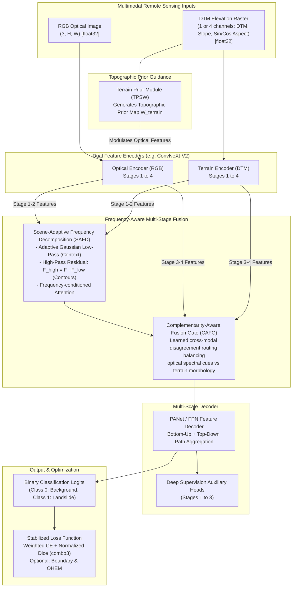

# Frequency-Aware Fusion (FAF) for Landslide Detection
### Multimodal Optical (RGB) & Continuous Elevation (DTM) Semantic Segmentation

[](https://www.python.org/downloads/)
[](https://pytorch.org/)
[](LICENSE)
[]()

This repository provides an end-to-end deep learning framework for multimodal semantic segmentation applied to **Landslide Detection**, integrating optical **RGB imagery** with continuous **Digital Terrain Models (DTM / Elevation rasters)**. 

Originally derived from the Frequency-Aware Fusion (FAF) framework for RGB-Thermal benchmarks, this codebase has been extensively adapted, stabilized, and re-architected into a terrain-aware multimodal pipeline designed to handle the physical and statistical realities of landslide remote sensing.

---

## 📑 Table of Contents
1. [Architecture Overview](#-architecture-overview)
2. [Key Features & Engineering Improvements](#-key-features--engineering-improvements)
3. [Repository Structure](#-repository-structure)
4. [Environment Setup & Installation](#-environment-setup--installation)
5. [Dataset Layout & Preprocessing](#-dataset-layout--preprocessing)
6. [Verification & Sanity Checks](#-verification--sanity-checks)
7. [Training Workflow](#-training-workflow)
8. [Inference, Evaluation & Visualization](#-inference-evaluation--visualization)
9. [Legacy Benchmarks (RGB-Thermal)](#-legacy-benchmarks-rgb-thermal)
10. [Licensing & Attribution](#-licensing--attribution)

---

## 🏗️ Architecture Overview

The framework fuses optical surface reflectance with topographic geometry across multiple frequency bands and spatial scales:



---

## 🌟 Key Features & Engineering Improvements

### 1. Robust Terrain Processing (`LandslideDataset.py`)
- **True Continuous Elevation:** DTM is loaded and maintained in unquantized `float32` representation rather than compressed 8-bit integers.
- **Physical Topographic Derivatives:** Topographic gradient calculation incorporates physical ground resolution (`pixel_scale` in meters/pixel). Aspect is parameterized continuously as $\sin(\text{aspect})$ and $\cos(\text{aspect})$ (flat terrain mapped to $(0, 0)$) to eliminate circular discontinuities.
- **NoData Integrity:** Unmeasured / NoData elevation pixels are imputed with local median to prevent NaN-bleeding, while corresponding ground-truth pixels are marked with `ignore_index = -100` so they never corrupt training loss.
- **Positive-Aware Sampling:** Landslide scars typically constitute only 1–3% of regional pixels. The dataset loader provides balanced positive patch cropping and optional `WeightedRandomSampler` (`positive_aware_sampler`) ensuring training batches consistently encounter active landslide foreground.

### 2. Terrain-Aware Architectural Formulation (`FusionModel.py`)
- **Topographic Prior Module (`TerrainPriorModule` / TPSW):** Computes continuous terrain weights based on elevation and slope gradients with centered bidirectional modulation ($f \times (0.5 + tp)$).
- **SAFD Decomposition:** Clear residual split ($F_{\text{high}} = F - F_{\text{low}}$) guarantees high-frequency structural contours are unconditionally defined and processed by the spatial-frequency attention mechanism.
- **Complementarity-Aware Fusion Gate (CAFG):** Uses cosine distance in a learned bottleneck projection ($d_{\cos} = 1 - \langle \hat{f}_{\text{rgb}}, \hat{f}_{\text{terrain}} \rangle$) as a dynamic routing signal across modalities.
- **Decoupled Unimodal Baselines:** Standalone `rgb_only` and `dtm_only` modes instantiate only the active backbone encoder, eliminating memory, FLOPs, and parameter inflation when establishing unimodal baselines. Supports heterogeneous backbone combinations (e.g. RGB Nano + DTM Tiny) through dynamic decoder channel routing.

### 3. Stabilized Objective & Metrics (`train.py`)
- **Normalized Weighted Dice:** Class-weighted Dice is mathematically normalized by the sum of weights, preventing negative loss values when class weights exceed 1.0.
- **Fail-Fast Class Weights:** Computes class weights directly from training split foreground frequencies with fail-fast assertions for zero-landslide edge cases.
- **Target-Aware OHEM:** Online hard example mining evaluates mispredictions against true class assignments rather than unconditioned maximum prediction probabilities.
- **True Cosine Annealing:** Standard Cosine Annealing with warmup (`torch.optim.lr_scheduler.CosineAnnealingLR`).
- **Landslide-Centric Validation:** Best checkpoint selection tracks **Landslide IoU** (Class 1) and F1-Score rather than overall mIoU, which is overwhelmed by background (>98%).

### 4. Config-Driven & Safe Inference (`eval.py`, `FusionModelUtils.py`)
- **Dynamic Checkpoint Loading:** Model architecture (`rgb_arch`, `ir_arch`, `num_classes`, `decoder_type`, `deep_supervision`, `novel_fusion`) is dynamically reconstructed from the checkpoint's saved configuration metadata with strict state verification (`strict=True`).
- **Correct ImageNet RGB Denormalization:** Ensures visualization grids render clear, undistorted aerial imagery.
- **Side-by-Side Diagnostics:** Output artifacts are written safely to `runs/demo_results/` displaying RGB, DTM, Ground Truth, and Prediction Overlay.

---

## 📁 Repository Structure

```text
FAF(FrequencyAwareFusion)/
├── configs/                       # Staged YAML experiment configurations (17 configurations)
│   ├── 01_baseline_vanilla.yaml   # FPN baseline
│   ├── 01b_baseline_panet.yaml    # PANet baseline
│   ├── 01c_baseline_panet_deepsup.yaml
│   ├── 02a_ablation_safd.yaml     # Ablation: SAFD only
│   ├── 02b_ablation_cafg.yaml     # Ablation: CAFG only
│   ├── 02c_ablation_tpsw.yaml     # Ablation: TPSW only
│   ├── 03a_combo_safd_cafg.yaml   # Combination: SAFD + CAFG
│   ├── 03b_combo_safd_tpsw.yaml   # Combination: SAFD + TPSW
│   ├── 03c_combo_cafg_tpsw.yaml   # Combination: CAFG + TPSW
│   ├── 04_full_proposed_faf.yaml  # Full proposed method: SAFD + CAFG + TPSW + PANet (1-Ch DTM)
│   ├── 05_full_faf_4channel.yaml  # 4-channel terrain (DTM, Slope, Aspect)
│   ├── 06_full_faf_ohem_boundary.yaml # OHEM + Boundary loss
│   ├── 07_baseline_rgb_only.yaml  # Decoupled unimodal RGB baseline
│   ├── 08_baseline_dtm_only.yaml  # Decoupled unimodal DTM baseline
│   ├── 09_ablation_local_relief.yaml # Relative local relief normalization
│   ├── 10_baseline_mfnet_rgbt.yaml # MFNet RGB-Thermal baseline
│   └── 11_full_faf_v2_5channel.yaml # Proposed 5-Channel FAF (RGB + DTM_NORM + SLOPE) on dataset_1V2
├── tools/
│   └── verify_raster_alignment.py # Raster spatial compatibility & GeoTIFF verification tool
├── legacy/                        # Isolated legacy RGB-Thermal components
│   ├── FusionModelDataset.py      # MFNet dataset loader (legacy)
│   ├── PST900Dataset.py           # PST900 dataset loader (legacy)
│   └── tent.py                    # Test-time adaptation (legacy)
├── docs/                          # Architecture records & domain guidelines
├── tests/                         # Comprehensive automated unit test suite
│   ├── test_landslide_dataset.py  # DTM, derivatives, NoData, sampling unit tests
│   ├── test_landslide_dataset_v2.py # V2: Blacklist, 5-channel, ignore mask, augmentations
│   ├── test_model.py              # SAFD, CAFG, TPSW, PANet, decoupled unimodal tests
│   └── test_inference_and_utils.py# Strict loading, denormalization, metric tests
├── FusionModel.py                 # Core multimodal network & novel fusion modules
├── LandslideDataset.py            # Multimodal RGB + DTM dataset loader (V1)
├── LandslideDatasetV2.py          # Multimodal 5-channel loader with blacklist & augmentations (V2)
├── train.py                       # Modernized training loop, evaluation, and checkpointing
├── eval.py                        # Modernized inference evaluation & diagnostic visualizer
├── FusionModelTrain.py            # Backwards-compatibility wrapper -> train.py
├── FusionModelRunDemo.py          # Backwards-compatibility wrapper -> eval.py
├── FusionModelUtils.py            # Metrics (IoU, F1), color palettes, plotting
├── requirements.txt               # Pip dependency specification
├── smoke_test.py                  # End-to-end model smoke test
└── LICENSE                        # MIT License & attribution notice
```

---

## 🛠️ Environment Setup & Installation

The repository uses standard Python virtual environments (`venv`) and `pip`. **No Conda environment files are required.**

### 1. Create and Activate Virtual Environment

**On Windows (PowerShell):**
```powershell
python -m venv .venv
.\.venv\Scripts\activate
```

**On Linux / macOS:**
```bash
python3 -m venv .venv
source .venv/bin/activate
```

### 2. Install PyTorch

Install the PyTorch build that matches your hardware:

**For NVIDIA GPU with CUDA 12.1+ (e.g. RTX 2060 Super):**
```bash
pip install torch torchvision torchaudio --index-url https://download.pytorch.org/whl/cu121
```

**For CPU-Only Development:**
```bash
pip install torch torchvision torchaudio --index-url https://download.pytorch.org/whl/cpu
```

### 3. Install Repository Dependencies

Install all remaining dependencies directly via `requirements.txt`:
```bash
pip install -r requirements.txt
```

---

## 📂 Dataset Layout & Preprocessing

Organize the landslide dataset in `dataset/dataset_1` (or specify `--data_root`):

```text
dataset/dataset_1/
├── train/
│   ├── IMAGE/     # RGB aerial imagery (.png, .jpg, .tif) -> [H, W, 3]
│   ├── DTM/       # Elevation rasters (.tif, .png)        -> [H, W] float32
│   └── LABEL/     # Binary segmentation masks (.png)     -> 0: BG, 65535 or 1: Landslide
├── val/
│   ├── IMAGE/
│   ├── DTM/
│   └── LABEL/
└── test/
    ├── IMAGE/
    ├── DTM/
    └── LABEL/
```

> **Data Integrity Rules:**
> - Matching filenames across `IMAGE/`, `DTM/`, and `LABEL/` must share the same base stem.
> - Spatial dimensions ($H \times W$) must match exactly across all modalities.
> - Ground truth label values are strictly validated: `0` (Background) and `65535` or `1` (Landslide). Unrecognized label values raise immediate errors.

---

## 🧪 Verification & Sanity Checks

Before launching long training runs, verify raster integrity, model execution, and unit tests:

### 1. Verify Raster Spatial Compatibility & Georeferencing
Validate image dimensions, channel reduction, and NoData values across all modalities:
```bash
python tools/verify_raster_alignment.py --data_dir dataset/dataset_1 --split test --sample_limit 20
```
*(If `rasterio` is installed, it also automatically verifies GeoTIFF CRS, affine transforms, and geographic bounds).*

### 2. Run Smoke Test Suite
Perform an offline forward and backward pass on any YAML configuration:
```bash
# Test full proposed architecture (offline, CPU or GPU)
python smoke_test.py --config_path configs/04_full_proposed_faf.yaml --device cpu --img_height 64 --img_width 64

# Test all YAML configurations
python smoke_test.py --yaml_configs --device cpu --img_height 64 --img_width 64
```

### 3. Run Unit Test Suite
Execute the comprehensive automated test suite:
```bash
python -m unittest discover -s tests -p "test_*.py"
```

---

## 🚀 Training Workflow

### 1. Training with Staged Experiment Configurations (Recommended)
All hyperparameters, data paths, loss settings, and architectural options are organized into reproducible YAML configs under `configs/`:

```bash
# Proposed Full Architecture (5-Channel V2 on dataset_1V2: RGB + DTM_NORM + SLOPE)
python train.py --config configs/11_full_faf_v2_5channel.yaml

# Proposed Full Architecture (1-Channel DTM baseline on dataset_1)
python train.py --config configs/04_full_proposed_faf.yaml

# Baseline Vanilla FPN
python train.py --config configs/01_baseline_vanilla.yaml

# Unimodal RGB-Only Baseline
python train.py --config configs/07_baseline_rgb_only.yaml

# Unimodal DTM-Only Baseline
python train.py --config configs/08_baseline_dtm_only.yaml
```

> **Note on Script Names:** `FusionModelTrain.py` and `FusionModelRunDemo.py` have been streamlined to `train.py` and `eval.py`. Shims are preserved for full backwards compatibility.

### 2. Training with Command-Line Overrides
You can override any parameter directly from the command line:
```powershell
python train.py `
    --dataset landslide_v2 `
    --data_root ./dataset/dataset_1V2 `
    --channels rgb,dtm,slope `
    --apply_blacklist `
    --ignore_rgb_black `
    --img_height 512 `
    --img_width 512 `
    --batch_size 4 `
    --grad_accum_steps 1 `
    --epochs 100 `
    --rgb_arch convnextv2_tiny.fcmae_ft_in22k_in1k_384 `
    --ir_arch convnextv2_tiny.fcmae_ft_in22k_in1k_384 `
    --decoder_type panet `
    --deep_supervision `
    --use_safd `
    --use_cafg `
    --use_tpsw `
    --loss_type combo3 `
    --class_weights `
    --positive_aware_sampling
```

### Key Training Options
| Argument | Default | Description |
| :--- | :--- | :--- |
| `--config` | `None` | Path to YAML configuration file (e.g. `configs/11_full_faf_v2_5channel.yaml`) |
| `--dataset` | `landslide` | Dataset type: `landslide` (V1), `landslide_v2` (V2), or `mfnet` |
| `--channels` | `rgb,dtm,slope` | Active channels for LandslideDatasetV2 (e.g. `rgb,dtm,slope` -> 5 channels) |
| `--apply_blacklist` | `True` | Filter out noisy tile stems registered in `black_list.txt` |
| `--ignore_rgb_black` | `True` | Ignore pure black RGB(0,0,0) void/border pixels during loss and metric calculation |
| `--loss_type` | `combo3` | Loss function (`combo3` = Weighted CE + Dice + Lovasz; `combo_ohem` = Combo + OHEM + Boundary) |
| `--include_derivatives` | `False` | Computes 4-channel terrain input `[DTM, Slope, Sin(Aspect), Cos(Aspect)]` (V1 only) |
| `--pixel_scale` | `1.0` | Physical ground resolution (meters/pixel) for accurate gradient calculation |
| `--positive_aware_sampling` | `False` | Ensures random crops center on landslide foreground pixels |
| `--decoder_type` | `panet` | Decoder architecture: `panet` (recommended) or `fpn` |
| `--deep_supervision` | `False` | Multi-stage auxiliary supervision during training |
| `--use_safd` | `False` | Enables Scene-Adaptive Frequency Decomposition |
| `--use_cafg` | `False` | Enables Complementarity-Aware Fusion Gate |
| `--use_tpsw` | `False` | Enables Topographic Prior-Guided Spatial Weighting |

---

## 📊 Inference, Evaluation & Visualization

Evaluate a saved checkpoint on the test split and generate side-by-side diagnostic visualization panels:

```powershell
python eval.py `
    --dataset landslide_v2 `
    --data_dir ./dataset/dataset_1V2 `
    --dataset_split test `
    --model_dir Experiments/11_full_faf_v2_5channel `
    --weight_name checkpoints `
    --file_name best.pth `
    --visualize
```

> **Note:** `eval.py` automatically reads the exact backbone architecture, decoder type, and fusion parameters directly from the checkpoint's embedded configuration metadata, guaranteeing full evaluation fidelity without manual CLI flags.

### Visualization Output (`runs/demo_results/`)
The visualizer exports composite diagnostic images containing:
1. **RGB Optical:** ImageNet-denormalized true-color optical frame.
2. **DTM Elevation:** Colormapped topographic terrain elevation.
3. **Ground Truth:** True segmentation mask (Black = Background, Vivid Red = Landslide).
4. **Model Prediction:** Model classification overlay on the optical image.

---

## 🏛️ Legacy Benchmarks (RGB-Thermal)

For historical reproducibility, the original RGB-Thermal urban scene datasets (MFNet, PST900) and test-time adaptation code are preserved under `legacy/`. Root-level shims (`FusionModelDataset.py`, `PST900Dataset.py`, `tent.py`) ensure existing external scripts continue to function transparently.

Original RGB-T benchmark checkpoints:
| Backbone | Dataset | mIoU | Checkpoint Link |
| :--- | :--- | :---: | :--- |
| **ConvNeXt-V2 Nano** | MFNet | 0.6173 | [MFNet Nano Checkpoint](https://drive.google.com/file/d/1pfUBBIdoftrjS2bSOIIG7l9krh6kBK9s/view?usp=sharing) |
| **ConvNeXt-V2 Tiny** | MFNet | 0.6113 | [MFNet Tiny Checkpoint](https://drive.google.com/file/d/1ofJGmORAXjlakvX1zn4un17El2XFJ2ci/view?usp=sharing) |
| **ConvNeXt-V2 Base** | MFNet | 0.5963 | [MFNet Base Checkpoint](https://drive.google.com/file/d/158K-qaOea3pfe-jZysQjrIfQIo1ANqla/view?usp=sharing) |
| **ConvNeXt-V2 Nano** | PST900 | 0.8624 | [PST900 Nano Checkpoint](https://drive.google.com/file/d/15TqSD6l5QTxtxLOwk4N9va36HhrTfGUo/view?usp=share_link) |
| **ConvNeXt-V2 Tiny** | PST900 | 0.8788 | [PST900 Tiny Checkpoint](https://drive.google.com/file/d/1ddY7EwZeEdfYRdfMom_vDzMR93ftpARc/view?usp=share_link) |
| **ConvNeXt-V2 Base** | PST900 | 0.8848 | [PST900 Base Checkpoint](https://drive.google.com/file/d/1D7SKkSe9vAIRUvi21ULCMR1HR1fHZ11q/view?usp=share_link) |

---

## 📜 Licensing & Attribution

This project is licensed under the **MIT License** — see the [LICENSE](LICENSE) file for details.

If you build upon this work, please acknowledge the original Frequency-Aware Fusion framework and the Landslide RGB-DTM multimodal adaptation:
```bibtex
@misc{faf_landslide_2026,
  author = {Pratama, Ananda Bintang and Contributors},
  title = {Frequency-Aware Fusion (FAF) for Multimodal Landslide Detection},
  year = {2026},
  publisher = {GitHub},
  howpublished = {\url{https://github.com/pratamabintang/FAF}}
}
```
