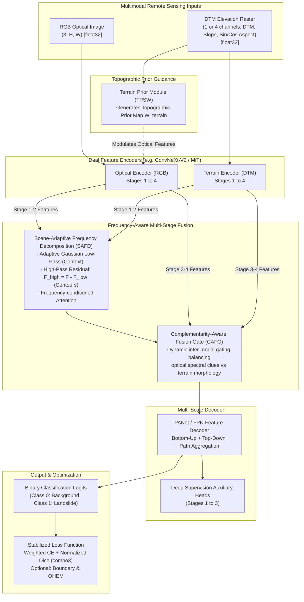

# Frequency-Aware Fusion (FAF) for Landslide Detection
### Multimodal Optical (RGB) & Continuous Elevation (DTM) Semantic Segmentation

[](https://www.python.org/downloads/)
[](https://pytorch.org/)
[](LICENSE)
[]()

This repository provides an end-to-end deep learning framework for multimodal semantic segmentation applied to **Landslide Detection**, integrating optical **RGB imagery** with continuous **Digital Terrain Models (DTM / Elevation rasters)**. 

Originally derived from the Frequency-Aware Fusion (FAF) framework for RGB-Thermal benchmarks, this codebase has been extensively adapted, stabilized, and re-architected into a terrain-aware multimodal pipeline designed to handle the physical and statistical realities of landslide remote sensing.

---

## 📑 Table of Contents
1. [Architecture Overview](#-architecture-overview)
2. [Key Features & Engineering Improvements](#-key-features--engineering-improvements)
3. [Repository Structure](#-repository-structure)
4. [Environment Setup & Installation](#-environment-setup--installation)
5. [Dataset Layout & Preprocessing](#-dataset-layout--preprocessing)
6. [Verification & Sanity Checks](#-verification--sanity-checks)
7. [Training Workflow](#-training-workflow)
8. [Inference, Evaluation & Visualization](#-inference-evaluation--visualization)
9. [Legacy Benchmarks (RGB-Thermal)](#-legacy-benchmarks-rgb-thermal)
10. [Licensing & Attribution](#-licensing--attribution)

---

## 🏗️ Architecture Overview

The framework fuses optical surface reflectance with topographic geometry across multiple frequency bands and spatial scales:



---

## 🌟 Key Features & Engineering Improvements

### 1. Robust Terrain Processing (`LandslideDataset.py`)
- **True Continuous Elevation:** DTM is loaded and maintained in unquantized `float32` representation rather than compressed 8-bit integers.
- **Physical Topographic Derivatives:** Topographic gradient calculation incorporates physical ground resolution (`pixel_scale` in meters/pixel). Aspect is parameterized continuously as $\sin(\text{aspect})$ and $\cos(\text{aspect})$ (flat terrain mapped to $(0, 0)$) to eliminate the $0^\circ \leftrightarrow 360^\circ$ circular discontinuity.
- **NoData Integrity:** Unmeasured / NoData elevation pixels are imputed with local median to prevent NaN-bleeding, while corresponding ground-truth pixels are marked with `ignore_index = -100` so they never corrupt training loss.
- **Positive-Aware Sampling:** Landslide scars typically constitute only 1–3% of regional pixels. The dataset loader provides balanced positive patch cropping and optional `WeightedRandomSampler` (`positive_aware_sampler`) ensuring training batches consistently encounter active landslide foreground.

### 2. Terrain-Aware Architectural Formulation (`FusionModel.py`)
- **Topographic Prior Module (`TerrainPriorModule` / TPSW):** Computes continuous terrain weights based on elevation and slope gradients, selectively accentuating optical features on prone slope geometries.
- **SAFD Decomposition Fix:** Proper residual split ($F_{high} = F - F_{low}$) guarantees that high-frequency structural contours are always defined and processed by the spatial-frequency attention mechanism.
- **Dynamic Channel Adaptation:** Encoders dynamically support either single-channel elevation inputs ($C=1$) or 4-channel terrain feature packs ($C=4$: DTM, Slope, $\sin(\text{Aspect})$, $\cos(\text{Aspect})$).

### 3. Stabilized Objective & Metrics (`FusionModelTrain.py`)
- **Normalized Weighted Dice:** Class-weighted Dice is mathematically normalized by the sum of weights, preventing negative loss values when class weights exceed 1.0.
- **Target-Aware OHEM:** Online hard example mining evaluates mispredictions against true class assignments rather than unconditioned maximum prediction probabilities.
- **True Cosine Annealing:** Replaced ad-hoc exponential decay with standard Cosine Annealing with warmup (`torch.optim.lr_scheduler.CosineAnnealingLR`).
- **Landslide-Centric Validation:** Best checkpoint selection tracks **Landslide IoU** (Class 1) and F1-Score rather than overall mIoU, which is overwhelmed by background (>98%).

### 4. Config-Driven & Safe Inference (`FusionModelRunDemo.py`, `FusionModelUtils.py`)
- **Dynamic Checkpoint Loading:** Model architecture (`rgb_arch`, `ir_arch`, `num_classes`, `decoder_type`, `deep_supervision`, `novel_fusion`) is dynamically reconstructed from the checkpoint's saved `config` dictionary with strict state verification (`strict=True`).
- **Correct ImageNet RGB Denormalization:** Ensures visualization grids render clear, undistorted aerial imagery.
- **Isolated Visualizations:** Output artifacts are written safely to `runs/demo_results/` without destructive folder deletions.

---

## 📁 Repository Structure

```text
FAF(FrequencyAwareFusion)/
├── configs/
│   └── experiment_config.yaml     # Central reproducible training configuration
├── legacy/                         # Isolated legacy RGB-Thermal components
│   ├── FusionModelDataset.py      # MFNet dataset loader (legacy)
│   ├── PST900Dataset.py           # PST900 dataset loader (legacy)
│   └── tent.py                    # Test-time adaptation (legacy)
├── docs/
│   └── audit_remediation_reference.md  # Comprehensive technical audit log
├── tests/
│   ├── test_landslide_dataset.py  # DTM, derivatives, NoData, sampling unit tests
│   ├── test_model.py              # SAFD, CAFG, TPSW, PANet, loss unit tests
│   └── test_inference_and_utils.py# Strict loading, denormalization, metric tests
├── FusionModel.py                 # Core multimodal network & fusion modules
├── LandslideDataset.py            # Multimodal RGB + DTM dataset loader
├── FusionModelTrain.py            # Training loop, evaluation, and checkpointing
├── FusionModelRunDemo.py          # Inference evaluation & diagnostic visualizer
├── FusionModelUtils.py            # Metrics (mIoU, F1), color palettes, plotting
├── environment-gpu.yml            # Conda environment definition (CUDA 12.1)
├── environment-cpu.yml            # Conda environment definition (CPU only)
├── requirements.txt               # Pip dependency specification
├── run_tests.py                   # Automated test suite runner
├── smoke_test.py                  # Forward/backward training smoke test
└── LICENSE                        # MIT License & attribution notice
```

---

## 🛠️ Environment Setup & Installation

### Option A: Conda GPU Environment (Recommended for NVIDIA RTX GPU / CUDA 12.1+)
```powershell
# Create Conda environment
conda env create -f environment-gpu.yml

# Activate environment
conda activate faf-landslide
```

### Option B: Conda CPU Environment (For development without discrete GPU)
```powershell
# Create CPU environment
conda env create -f environment-cpu.yml

# Activate environment
conda activate faf-landslide-cpu
```

### Option C: Standard Pip Installation
```powershell
# Create and activate virtual environment
python -m venv .venv
.\.venv\Scripts\activate

# Install PyTorch with CUDA 12.1
pip install torch torchvision torchaudio --index-url https://download.pytorch.org/whl/cu121

# Install repository dependencies
pip install -r requirements.txt
```

---

## 📂 Dataset Layout & Preprocessing

Organize the landslide dataset in `dataset/dataset_1` (or specify `--data_root`):

```text
dataset/dataset_1/
├── train/
│   ├── IMAGE/     # RGB aerial imagery (.png, .jpg, .tif) -> [H, W, 3]
│   ├── DTM/       # Elevation rasters (.tif, .png)        -> [H, W] float32
│   └── LABEL/     # Binary segmentation masks (.png)     -> 0: BG, 65535 or 1: Landslide
├── val/
│   ├── IMAGE/
│   ├── DTM/
│   └── LABEL/
└── test/
    ├── IMAGE/
    ├── DTM/
    └── LABEL/
```

> **Data Integrity Rules:**
> - Matching filenames across `IMAGE/`, `DTM/`, and `LABEL/` must share the same base stem.
> - Spatial dimensions ($H \times W$) must match exactly across all modalities.
> - Ground truth label values are strictly validated: `0` (Background) and `65535` or `1` (Landslide). Unrecognized label values raise immediate errors.

---

## 🧪 Verification & Sanity Checks

Before launching experiments, verify all components using the built-in test suite:

```powershell
# Run the complete unit test suite (32 tests)
python run_tests.py

# Run a synthetic multimodal forward & backward pass smoke test
python smoke_test.py
```

Expected output:
```text
[TEST SUITE SUCCESS] Passed all 32 unit test cases.
[SMOKE TEST SUCCESS] Multimodal forward and backward steps executed without errors.
```

---

## 🚀 Training Workflow

### 1. Training with Reproducible Configuration (Recommended)
All hyperparameters, data paths, loss settings, and architectural options are centralized in `configs/experiment_config.yaml`:

```powershell
python FusionModelTrain.py --config configs/experiment_config.yaml
```

### 2. Training with Command-Line Overrides
```powershell
python FusionModelTrain.py `
    --dataset landslide `
    --data_root ./dataset/dataset_1 `
    --img_height 512 `
    --img_width 512 `
    --batch_size 4 `
    --grad_accum_steps 2 `
    --epochs 300 `
    --rgb_arch convnextv2_tiny.fcmae_ft_in22k_in1k_384 `
    --ir_arch convnextv2_tiny.fcmae_ft_in22k_in1k_384 `
    --decoder_type panet `
    --deep_supervision `
    --loss_type combo3 `
    --class_weights `
    --positive_aware_sampling
```

### Key Training Options
| Argument | Default | Description |
| :--- | :--- | :--- |
| `--config` | `None` | Path to YAML configuration file |
| `--loss_type` | `combo3` | Loss function (`combo3` = Weighted CE + Dice; `combo_ohem` = CE + Dice + OHEM + Boundary) |
| `--include_derivatives` | `False` | Computes 4-channel terrain input `[DTM, Slope, Sin(Aspect), Cos(Aspect)]` |
| `--pixel_scale` | `1.0` | Physical ground resolution (meters/pixel) for accurate gradient calculation |
| `--positive_aware_sampling` | `False` | Ensures random crops center on landslide foreground pixels |
| `--decoder_type` | `panet` | Decoder architecture: `panet` (recommended) or `fpn` |
| `--deep_supervision` | `False` | Multi-stage auxiliary supervision during training |

---

## 📊 Inference, Evaluation & Visualization

Evaluate the model checkpoint on the test split and generate side-by-side diagnostic visualization panels:

```powershell
python FusionModelRunDemo.py `
    --dataset landslide `
    --data_dir ./dataset/dataset_1 `
    --dataset_split test `
    --model_dir Experiments/faf_landslide_experiment_v1 `
    --weight_name checkpoints `
    --file_name best_model.ema.pth `
    --visualize
```

> **Note:** `FusionModelRunDemo.py` automatically reads the exact backbone architecture, decoder type, and fusion parameters directly from the checkpoint's embedded configuration metadata, guaranteeing full evaluation fidelity without manual CLI flags.

### Visualization Output (`runs/demo_results/`)
The visualizer exports diagnostic composite images containing:
1. **RGB Optical:** ImageNet-denormalized true-color optical frame.
2. **DTM Elevation:** Colormapped topographic terrain elevation.
3. **Ground Truth:** True segmentation mask (Black = Background, Red = Landslide).
4. **Model Prediction:** Model classification overlay on the optical image.

---

## 🏛️ Legacy Benchmarks (RGB-Thermal)

For historical reproducibility, the original RGB-Thermal urban scene datasets (MFNet, PST900) and test-time adaptation code are preserved under `legacy/`. Root-level shims (`FusionModelDataset.py`, `PST900Dataset.py`, `tent.py`) ensure existing external scripts continue to function transparently.

Original RGB-T benchmark checkpoints:
| Backbone | Dataset | mIoU | Checkpoint Link |
| :--- | :--- | :---: | :--- |
| **ConvNeXt-V2 Nano** | MFNet | 0.6173 | [MFNet Nano Checkpoint](https://drive.google.com/file/d/1pfUBBIdoftrjS2bSOIIG7l9krh6kBK9s/view?usp=sharing) |
| **ConvNeXt-V2 Tiny** | MFNet | 0.6113 | [MFNet Tiny Checkpoint](https://drive.google.com/file/d/1ofJGmORAXjlakvX1zn4un17El2XFJ2ci/view?usp=sharing) |
| **ConvNeXt-V2 Base** | MFNet | 0.5963 | [MFNet Base Checkpoint](https://drive.google.com/file/d/158K-qaOea3pfe-jZysQjrIfQIo1ANqla/view?usp=sharing) |
| **ConvNeXt-V2 Nano** | PST900 | 0.8624 | [PST900 Nano Checkpoint](https://drive.google.com/file/d/15TqSD6l5QTxtxLOwk4N9va36HhrTfGUo/view?usp=share_link) |
| **ConvNeXt-V2 Tiny** | PST900 | 0.8788 | [PST900 Tiny Checkpoint](https://drive.google.com/file/d/1ddY7EwZeEdfYRdfMom_vDzMR93ftpARc/view?usp=share_link) |
| **ConvNeXt-V2 Base** | PST900 | 0.8848 | [PST900 Base Checkpoint](https://drive.google.com/file/d/1D7SKkSe9vAIRUvi21ULCMR1HR1fHZ11q/view?usp=share_link) |

---

## 📜 Licensing & Attribution

This project is licensed under the **MIT License** — see the [LICENSE](LICENSE) file for details.

If you build upon this work, please acknowledge the original Frequency-Aware Fusion framework and the Landslide RGB-DTM multimodal adaptation:
```bibtex
@misc{faf_landslide_2026,
  author = {Pratama, Ananda Bintang and Contributors},
  title = {Frequency-Aware Fusion (FAF) for Multimodal Landslide Detection},
  year = {2026},
  publisher = {GitHub},
  howpublished = {\url{https://github.com/pratamabintang/FAF}}
}
```
