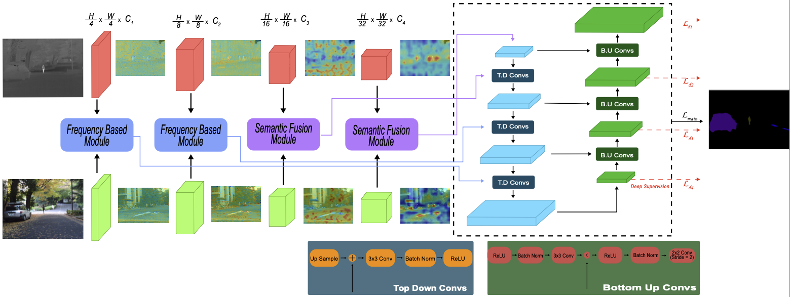

# Frequency-Aware Fusion (FAF) for Multimodal Semantic Segmentation
### Dedicated Pipeline for Landslide Detection (RGB + DTM / Elevation) & RGB-T Benchmarks



This repository provides an end-to-end framework for multimodal semantic segmentation using **Frequency-Aware Fusion (FAF)**. It natively supports **Landslide Detection** combining optical **RGB imagery** with continuous **Digital Terrain Models (DTM / Elevation rasters)**, alongside standard RGB-Thermal benchmarks (MFNet, PST900).

---

## 📑 Table of Contents
1. [Key Features & Improvements](#-key-features--improvements)
2. [Repository Setup & Environment Installation](#-repository-setup--environment-installation)
3. [Dataset Structure](#-dataset-structure)
4. [Sanity Checks & Verification (Smoke Tests)](#-sanity-checks--verification-smoke-tests)
5. [Training & Optimization](#-training--optimization)
6. [Inference, Evaluation & Visualization](#-inference-evaluation--visualization)
7. [Benchmark Weights & Checkpoints](#-benchmark-weights--checkpoints)

---

## 🌟 Key Features & Improvements

- **Dedicated Multimodal Landslide Loader (`LandslideDataset.py`):**
  - Reads **RGB** (3-channel `float32 [3, H, W]`).
  - Preserves continuous **DTM elevation** in true `float32 [1, H, W]` without `uint8` quantization.
  - Generates integer binary mask (`0 = Background`, `1 = Landslide`).
  - Pre-filters invalid/NoData pixels with median imputation to prevent *NaN-bleeding*.
  - Synchronous coordinated spatial augmentations (crop/flip/rotate90) across all modalities.
  - Strict P1 physical constraint: color jitter only applied to RGB (no thermal/color distortion on DTM, no non-rigid artifacts).
- **Novel Frequency & Attention Modules:**
  - **SAFD** (*Scene-Adaptive Frequency Decomposition*): Symmetric low/high frequency decomposition with GroupNorm for single-batch robustness.
  - **CAFG** (*Complementarity-Aware Fusion Gate*): Adaptive spatial-frequency cross-modal gating.
  - **TPSW** (*Thermal/Terrain Prior-Guided Spatial Weighting*): Spatial attention conditioned on topography.
- **Extreme Class Imbalance Mitigation:**
  - Hybrid Objective: `ComboLossOHEM` (Weighted Cross Entropy + Multiclass Dice + Lovasz-Softmax + OHEM + Boundary Loss + Focal Loss).
  - Dynamic inverse frequency class weighting tailored for rare landslide pixels (~2%).
- **Hardware-Agnostic & Memory-Optimized:**
  - Automatic Mixed Precision (`torch.amp.autocast`) and Gradient Accumulation tuned for RTX 2060 Super (8GB VRAM) and CPU fallback.

---

## 🛠️ Repository Setup & Environment Installation

### Option A: GPU Environment (Recommended for RTX 2060 Super / CUDA 12.1+)
```powershell
# 1. Create Conda environment with PyTorch GPU
conda env create -f environment-gpu.yml

# 2. Activate environment
conda activate faf-landslide
```

### Option B: CPU-Only Environment (For development/laptop without discrete GPU)
```powershell
# 1. Create CPU environment
conda env create -f environment-cpu.yml

# 2. Activate environment
conda activate faf-landslide-cpu
```

### Option C: Standard Pip Installation
```powershell
# Create virtual environment
python -m venv .venv
.\.venv\Scripts\activate

# Install PyTorch with CUDA 12.1
pip install torch torchvision --index-url https://download.pytorch.org/whl/cu121

# Install repository dependencies
pip install -r requirements.txt
```

---

## 📁 Dataset Structure

For **Landslide Segmentation**, place your data in `dataset/dataset_1` formatted as follows:

```text
dataset/dataset_1/
├── train/
│   ├── IMAGE/     # RGB images (.png, .jpg, .tif) -> uint8 [512, 512, 3]
│   ├── DTM/       # Elevation rasters (.tif, .png) -> float32 [512, 512]
│   └── LABEL/     # Binary segmentation masks (.png) -> [0, 65535] (0=BG, >0=Landslide)
├── val/
│   ├── IMAGE/
│   ├── DTM/
│   └── LABEL/
└── test/
    ├── IMAGE/
    ├── DTM/
    └── LABEL/
```

---

## 🧪 Sanity Checks & Verification (Smoke Tests)

Before launching full training, run the unit tests and forward/backward smoke test:

```powershell
# 1. Run all unit tests (Dataset loader, float32 DTM, NoData, Model architecture)
python run_tests.py

# 2. Run multimodal forward-backward smoke test
python smoke_test.py
```

Expected output:
```text
[PASS] Unit tests passed (0 failures).
[PASS] Output tensor shape: [2, 2, 512, 512] (Free of NaN / Inf).
[PASS] Loss computed, backward pass and optimizer step executed successfully.
```

---

## 🚀 Training & Optimization

Train the model using the reproducible configuration file:

```powershell
# Train with YAML configuration (Pre-tuned for Landslide dataset & RTX 2060 Super)
python FusionModelTrain.py --config configs/experiment_config.yaml
```

### Key Training Options (CLI Overrides)
```powershell
python FusionModelTrain.py \
    --dataset landslide \
    --data_root ./dataset/dataset_1 \
    --img_height 512 \
    --img_width 512 \
    --batch_size 4 \
    --grad_accum_steps 2 \
    --epochs 300 \
    --rgb_arch convnextv2_tiny.fcmae_ft_in22k_in1k_384 \
    --ir_arch convnextv2_tiny.fcmae_ft_in22k_in1k_384 \
    --decoder_type panet \
    --loss_type combo_ohem \
    --class_weights
```

Checkpoints, TensorBoard events, and best EMA weights will be saved in `Experiments/faf_landslide_experiment_v1/`.

---

## 📊 Inference, Evaluation & Visualization

Evaluate the trained model on the test split and generate 4-panel diagnostic visualizations:

```powershell
python FusionModelRunDemo.py \
    --dataset landslide \
    --data_dir ./dataset/dataset_1 \
    --dataset_split test \
    --model_dir Experiments/faf_landslide_experiment_v1 \
    --weight_name checkpoints \
    --file_name best_model.ema.pth \
    --img_height 512 \
    --img_width 512 \
    --visualize
```

### Diagnostic Panels Output (`runs/demo_results/`)
The visualizer outputs side-by-side diagnostic grids containing:
1. **RGB Image** (Input Optical)
2. **DTM Elevation** (Colormapped terrain / Turbo gradient)
3. **Ground Truth Mask** (Black = Background, Red = Landslide)
4. **Prediction Overlay** (Predicted mask overlaid on RGB image)

---

## 🏆 Benchmark Weights & Checkpoints

Pretrained baseline weights from previous thermal benchmarks (MFNet & PST900):

| Backbone | Dataset | mIoU | Checkpoint Link |
| :--- | :--- | :---: | :--- |
| **ConvNeXt-V2 Nano** | MFNet | 0.6173 | [MFNet Nano FusionModel](https://drive.google.com/file/d/1pfUBBIdoftrjS2bSOIIG7l9krh6kBK9s/view?usp=sharing) |
| **ConvNeXt-V2 Tiny** | MFNet | 0.6113 | [MFNet Tiny FusionModel](https://drive.google.com/file/d/1ofJGmORAXjlakvX1zn4un17El2XFJ2ci/view?usp=sharing) |
| **ConvNeXt-V2 Base** | MFNet | 0.5963 | [MFNet Base FusionModel](https://drive.google.com/file/d/158K-qaOea3pfe-jZysQjrIfQIo1ANqla/view?usp=sharing) |
| **ConvNeXt-V2 Nano** | PST900 | 0.8624 | [PST900 Nano FusionModel](https://drive.google.com/file/d/15TqSD6l5QTxtxLOwk4N9va36HhrTfGUo/view?usp=share_link) |
| **ConvNeXt-V2 Tiny** | PST900 | 0.8788 | [PST900 Tiny FusionModel](https://drive.google.com/file/d/1ddY7EwZeEdfYRdfMom_vDzMR93ftpARc/view?usp=share_link) |
| **ConvNeXt-V2 Base** | PST900 | 0.8848 | [PST900 Base FusionModel](https://drive.google.com/file/d/1D7SKkSe9vAIRUvi21ULCMR1HR1fHZ11q/view?usp=share_link) |

---

## 📜 Citation & Acknowledgements
If you find this code helpful in your research, please cite the Frequency-Aware Fusion framework and respective dataset sources.
